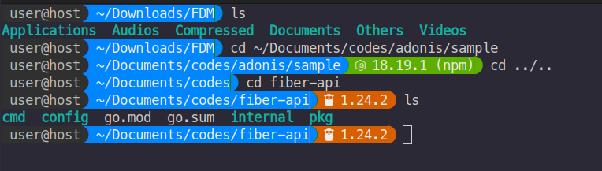

# Agnopro ZSH Theme

A high-performance, feature-rich ZSH theme with intelligent context display, inspired by and based on Agnoster but enhanced with additional developer-friendly features.



## Features

- **Performance Caching**: Minimizes slowdowns by caching version information
- **Technology Detection**: Automatically detects and displays:
  - Node.js versions (with package manager indicator)
  - Go versions
  - .NET versions
  - Docker projects
  - Git status with clean/dirty indicators
  - AWS profiles (with production warning colors)
  - Python virtual environments
- **Smart Context Display**: Shows user@host only when needed (SSH or non-default user)
- **Job & Process Status**: Visual indicators for background jobs and exit codes
- **Fully Customizable**: Easy configuration for colors and segment enabling/disabling
- **Terminal Compatibility**: Works across different terminal emulators

## Installation

### For Oh My ZSH Users (Recommended)

1. Download the theme or clone the repository 

2. move theme to your Oh My ZSH custom themes directory.

3. Set the theme in your `.zshrc`:
```bash
ZSH_THEME="agnopro"
```

3. Restart your terminal or run:
```bash
source ~/.zshrc
```


## Configuration

### Default User

To hide the username and hostname in local sessions, set your default username in `.zshrc` before sourcing the theme:

```bash
DEFAULT_USER="your_username"
```

### Enable/Disable Segments

All segments are enabled by default. To disable any segment, add to your `.zshrc` before sourcing the theme:

```bash
# Disable specific segments
ENABLE_NODE_PROMPT=0
ENABLE_DOCKER_PROMPT=0
# etc...
```

Available segments to configure:
- `ENABLE_STATUS_PROMPT` - Exit code and process status
- `ENABLE_CONTEXT_PROMPT` - Username and hostname
- `ENABLE_DIR_PROMPT` - Current directory
- `ENABLE_NODE_PROMPT` - Node.js version
- `ENABLE_GO_PROMPT` - Go version
- `ENABLE_DOTNET_PROMPT` - .NET version
- `ENABLE_DOCKER_PROMPT` - Docker project indicator
- `ENABLE_GIT_PROMPT` - Git branch and status
- `ENABLE_AWS_PROMPT` - AWS profile
- `ENABLE_VIRTUALENV_PROMPT` - Python virtual environment

### Custom Colors

To customize colors, add to your `.zshrc` before sourcing the theme:

```bash
# Examples of color customization
CUSTOM_DIR_BG=34     # Change directory background to blue
CUSTOM_DIR_FG=255    # Change directory text to white
```

### Changing Segment Order

Reorder segments by setting the `PROMPT_ORDER` variable in your `.zshrc` before sourcing the theme:

```bash
# Custom ordering of segments
PROMPT_ORDER=(status context dir git node go docker)
```

## Terminal Font Requirements

This theme works best with a powerline-compatible font that includes the necessary glyphs:

- [Nerd Fonts](https://www.nerdfonts.com/) - Collection of patched fonts
- [Powerline Fonts](https://github.com/powerline/fonts) - Patched fonts for Powerline users

### VS Code Configuration

If using VS Code's integrated terminal, add this to your VS Code settings.json:

```json
"terminal.integrated.fontFamily": "MesloLGS NF"
```

Replace "MesloLGS NF" with your preferred Nerd Font.

## Troubleshooting

### Icons Not Displaying Correctly

If you see boxes or question marks instead of icons:
1. Ensure you have a Nerd Font installed and configured in your terminal
2. For VS Code, configure the integrated terminal font as shown above
3. Some terminal emulators may require additional configuration

### Slow Performance

If your prompt is slow to appear:
1. The theme uses caching to minimize slowdowns, but large git repositories might cause delays
2. Disable segments you don't need with the configuration options above

## Contributing

Contributions are welcome! Please feel free to submit a Pull Request.

## License

This project is licensed under the MIT License - see the LICENSE file for details.

## Acknowledgments

- Inspired by and based on the [Agnoster](https://github.com/agnoster/agnoster-zsh-theme) ZSH theme
- Thanks to all contributors and testers
